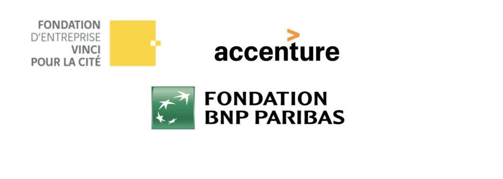

Le Guide du Bleu est la résultante de la transformation d’aventures intellectuelles individuelles en une aventure collective, par des jeunes personnes soucieuses d’améliorer le quotidien d’individus au parcours similaire au leur. Diversité Alternative tient donc à remercier toutes les personnes ayant donné de leur temps, de leur énergie et de leur savoir-faire pour la réalisation de ce projet.

Une profonde gratitude également à l’endroit de la Fondation Vinci Energies et de la Fondation Accenture qui grâce à leur généreux soutien financier, ont permis aux bénévoles de l’association de mettre une nouvelle version de l’ouvrage « le Guide du Bleu » à disposition de tous et ceci dans plusieurs langues.

